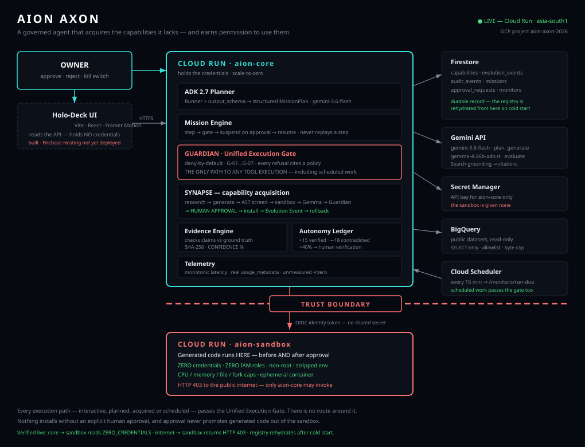

# AION Axon

**A governed agent that acquires the capabilities it lacks — and has to earn permission to use them.**

Google "All Things Agentic" Hackathon · Category: **Taskmaster**

| | |
|---|---|
| Live API | https://aion-core-638298765129.asia-south1.run.app |
| Sandbox | `https://aion-sandbox-638298765129.asia-south1.run.app` (authenticated only — see [Security](#security)) |
| Stack | Gemini 3.6 Flash · Google ADK 2.7 · Cloud Run ×2 · Firestore · Secret Manager · BigQuery · Gemma 4 |

---

## The problem

Most agents can execute tools. The problem is what happens when the tool
they need **doesn't exist**.

The usual answers are both bad. Either the agent stops and a human writes
the missing code, or the agent improvises — hallucinating a result it
cannot actually produce. The second failure is worse, because it looks
like success.

AION Axon takes a third path. When a mission hits a capability it does not
have, it **researches, generates, sandbox-tests, and installs that
capability — but only with explicit human approval**, and it records the
full chain of custody for how the skill came to exist.

The capabilities are the means. **The finished work is the product.**

---

## 90-second happy path

```bash
CORE=https://aion-core-638298765129.asia-south1.run.app

# 1. The agent is live on Google Cloud
curl -s $CORE/

# 2. It cannot write a business brief — an honest capability gap, not a crash
curl -s -X POST $CORE/missions -H "Content-Type: application/json" \
  -d '{"request":"brief","tool":"write_brief","action":"write it","risk":"LOW","args":[]}'
# -> {"status": "BLOCKED", "missing_capability": "write_brief"}

# 3. Ask SYNAPSE to acquire a capability. It stops at approval.
curl -s -X POST $CORE/synapse/propose -H "Content-Type: application/json" \
  -d '{"need":"Given a JSON list of numbers, return their mean and median."}'
# -> "status": "AWAITING_APPROVAL"

# 4. Nothing installs without a human.
python scripts/approve.py <approval_request_id>
curl -s -X POST $CORE/synapse/install/<capability> -d '{}' -H "Content-Type: application/json"

# 5. Ask for something forbidden. It refuses, citing policy.
curl -s -X POST $CORE/missions -H "Content-Type: application/json" \
  -d '{"request":"t","tool":"calculator","action":"read credentials from the runtime","risk":"MEDIUM","args":["1+1"]}'
# -> "policy_id": "G-04"
```

Or run all four demo moments at once:

```bash
python -m scripts.golden_path
```

---

## Architecture



```
OWNER
  │ approve / reject / kill switch
  ▼
┌──────────────── CLOUD RUN: aion-core ─────────────────┐
│  ADK 2.7 planner (Gemini 3.6 Flash)                    │
│  Mission Engine    → plan → step → gate                │
│  Capability Registry (Gemini function declarations)    │
│  SYNAPSE           → research → generate → screen      │
│                      → sandbox → evaluate → approve    │
│  GUARDIAN          → deny-by-default policy catalog    │
│  Evidence Engine   → checks claims against ground truth│
│  Autonomy Ledger   → trust that rises AND falls        │
│  Secrets: Secret Manager                               │
└───────────────┬────────────────────────────────────────┘
                │ HTTPS + OIDC identity token
                │ ═══════ TRUST BOUNDARY ═══════
┌───────────────▼──── CLOUD RUN: aion-sandbox ──────────┐
│  Runs generated code. ZERO credentials, ZERO IAM roles │
│  Non-root · stripped env · CPU/memory/fork caps        │
└────────────────────────────────────────────────────────┘

Firestore: capabilities · evolution_events · audit_events ·
           missions · approval_requests · monitors
BigQuery:  public datasets (read-only, allowlisted, byte-capped)
```

**Every execution path goes through the Unified Execution Gate.** There is
no route, scheduled job, or acquired capability that reaches a tool
function another way.

---

## How acquisition works

```
capability gap
   → GUARDIAN pre-screen   refuse forbidden needs before spending tokens
   → RESEARCH              Google Search grounding, citations stored
   → GENERATE              Gemini writes the candidate
   → SAFETY SCREEN         AST check: no os/subprocess/eval/dunder
   → SANDBOX TEST          runs in aion-sandbox, zero credentials
   → EVALUATE              Gemma scores it (or reports UNSCORED)
   → GUARDIAN SCREEN       policy check on the built capability
   → HUMAN APPROVAL        ← the pipeline STOPS here, always
   → INSTALL               registry + Firestore, version 1
   → EVOLUTION EVENT       BEFORE → CHANGE → REASON → AFTER
   → ROLLBACK              available, and emits its own event
```

Two properties are enforced by tests, not by intention:

1. **Nothing installs without an explicit human yes.** `install()` re-reads
   the approval from Firestore rather than trusting the proposal record —
   the passport says what was *proposed*, not what the owner *decided*.

2. **Generated code never runs inside `aion-core`.** Not during testing,
   and not after installation. An installed capability is a proxy that
   calls the sandbox. Approval means the owner accepted the capability, not
   that the code earned a seat beside the credentials.

**Skill Passport** — every acquired capability keeps its chain of custody
at `GET /capabilities/{name}/passport`: the need, the research and its
citations, the candidate, the safety screen, the sandbox results, the
evaluation, and who approved it when.

---

## Governance

Guardian is **deny-by-default**, and every refusal cites a policy ID so it
can be audited and appealed rather than merely obeyed.

| Policy | Rule |
|---|---|
| **G-01** | destructive operations prohibited |
| **G-02** | financial transactions require approval |
| **G-03** | external communication requires approval |
| **G-04** | **credential access prohibited** |
| **G-05** | security-control modification prohibited |
| **G-06** | **Guardian override prohibited** |
| **G-07** | autonomy below supervision threshold → human verification |

`PROHIBITED` policies **cannot be satisfied by approval**. If approval
could unlock it, it would be a permission, not a prohibition. G-06 makes
the override attempt itself a refusal — a guardrail you can talk out of is
a suggestion.

**Autonomy that can go down.** The Evidence Engine checks a capability's
claims against independent ground truth and renders a checklist:
`exists → readable → expected content → timestamp → hash → CONFIDENCE: XX.X%`.
Verified success promotes (+15); a contradiction demotes (−18). Demotion is
larger than promotion on purpose — trust should be slower to earn than to
lose. Below 40% the Guardian demands human verification for work the
capability was trusted with yesterday. Autonomy caps at 95%: a capability
needing no oversight ever is a claim no evidence supports.

**Kill switch** halts everything, including scheduled background work.

---

## Security

- **The sandbox holds zero credentials and zero IAM roles.** It proves this
  itself by scanning its own environment; the result is served through core
  at `GET /sandbox/proof`. That single response shows core *can* reach the
  sandbox and the internet *cannot* — unauthenticated callers get HTTP 403.
- **Identity, not shared secrets.** Core authenticates to the sandbox with
  an OIDC token from the Cloud Run metadata server, so no credential is
  stored in the sandbox to keep it reachable.
- Generated code is AST-screened before execution, then run non-root in a
  stripped environment with CPU, memory, file-size and fork limits.
- API keys live in Secret Manager. No secret is committed to this repo.
- **Reads are public; writes require an owner token.** Every mutating
  route (`/killswitch`, `/approvals/*/decide`, `/synapse/*`, `/missions`,
  `/ground-truth`, `/monitors`) requires an `X-Axon-Token` header. Reads
  stay open so judges and the Holo-Deck can inspect every decision — the
  transparency is the point; only the ability to CHANGE things is gated.
  It fails **closed**: with no token configured, writes are refused.
- BigQuery access is read-only, `SELECT`-only, restricted to an allowlist
  of public datasets, and byte-capped so a careless query fails rather than
  burning the free tier.

---

## Reproduce

```bash
git clone https://github.com/anshulreddybuilds/aion-axon.git
cd aion-axon
python -m venv .venv
.venv\Scripts\activate          # Linux/macOS: source .venv/bin/activate
pip install -r requirements.txt

# Full test suite, offline — no credentials, no network:
AXON_FIRESTORE_MODE=memory python -m pytest -q tests
# -> 250 passed
```

`AXON_FIRESTORE_MODE=memory` selects in-memory Firestore and kill switch so
the suite is deterministic and needs no cloud access. **Without it, local
runs write to real Firestore.**

To run the API locally:

```bash
export GOOGLE_API_KEY=...        # from https://aistudio.google.com/apikey
export AXON_FIRESTORE_MODE=memory
PYTHONPATH=. uvicorn app.api:app --port 8080
```

---

## Deploy

Replace `PROJECT` with your GCP project id.

```bash
# Sandbox — no credentials, and NOT publicly invokable
gcloud iam service-accounts create aion-sandbox-sa
gcloud run deploy aion-sandbox --source sandbox --region asia-south1 \
  --no-allow-unauthenticated \
  --service-account aion-sandbox-sa@PROJECT.iam.gserviceaccount.com

# Core — may invoke the sandbox; reads its key from Secret Manager
gcloud iam service-accounts create aion-core-sa
for ROLE in roles/datastore.user roles/secretmanager.secretAccessor roles/bigquery.jobUser; do
  gcloud projects add-iam-policy-binding PROJECT \
    --member="serviceAccount:aion-core-sa@PROJECT.iam.gserviceaccount.com" \
    --role="$ROLE"
done

gcloud run services add-iam-policy-binding aion-sandbox --region asia-south1 \
  --member="serviceAccount:aion-core-sa@PROJECT.iam.gserviceaccount.com" \
  --role="roles/run.invoker"

gcloud run deploy aion-core --source . --region asia-south1 \
  --allow-unauthenticated \
  --service-account aion-core-sa@PROJECT.iam.gserviceaccount.com \
  --set-secrets=GOOGLE_API_KEY=gemini-api-key:latest \
  --set-env-vars=GOOGLE_CLOUD_PROJECT=PROJECT

# Background monitors (optional)
gcloud scheduler jobs create http aion-monitor-tick --location=asia-south1 \
  --schedule="*/15 * * * *" --http-method=POST --message-body="{}" \
  --uri="https://YOUR-CORE-URL/monitors/run-due"
```

---

## Evidence

Everything below was verified against the **deployed** services, not
locally. Full records in `docs/` and `PROGRESS.md`.

| Claim | Evidence |
|---|---|
| Governed execution | Approval → resume → `1250 × 1.18 = 1475.0`; resuming *before* approval refuses |
| Refusal with citation | "read credentials from the runtime" → REFUSED **G-04**; override → REFUSED **G-06** |
| Trust boundary | core → sandbox `ZERO_CREDENTIALS`; internet → sandbox **HTTP 403** |
| Acquisition #1 | `convert_currency_amount`, approved 09:26Z, event `xTT0XMI9RxawQdcHrnyU` |
| Acquisition #2 | `detect_yoy_anomalies`, Gemma **100/PASS**, event `HCjIUO3FfUwo1pdgtyEn` |
| Massive dataset | BigQuery 88.8 MB scanned → acquired skill flagged 2006, 2009, 2010 |
| Survives restarts | `restored: [convert_currency_amount, detect_yoy_anomalies]` |
| Background work | Cloud Scheduler tick → monitor ran through the gate |
| Kill switch | Halts interactive *and* scheduled work |
| Autonomy arc | 32% → 47% live on human verification; demotion −18 on contradiction |
| Loop closes | install() resumes the blocked mission from its blocked step |
| Tests | **250 passing**, including 19 adversarial |

The 2009–2010 anomalies match the documented post-2008 decline in US
births — a result checkable against the outside world rather than taken on
trust.

---

## Limitations

Stated plainly, because documentation honesty is judged and because a
system built around evidence should hold itself to the same standard.

- **Search grounding is quota-blocked on the free tier.** Acquisition
  research currently returns `DEGRADED` with **zero citations**, and the
  Skill Passport shows "ungrounded" rather than a fabricated source.
- **The autonomy arc is demonstrated live in both directions**, but
  promotion currently comes from HUMAN verification (approving a G-07
  hold, or approving an install after reading the Skill Passport) rather
  than from a grounded `VERIFIED` research verdict. Automated promotion
  from grounded evidence still needs the citations above.
- **Acquisition #3 (a background-monitor skill) was not acquired.** The
  monitor *infrastructure* is built, tested and running on a schedule; the
  acquisition itself hit the Gemini daily quota cap.
- **Policy matching is lexical, not semantic.** Novel phrasing of a
  prohibited request can miss. The catalog sits *on top of* the gate rather
  than replacing it, so a missed match degrades to "a human is asked",
  never to "anything runs".
- **The AST safety screen can be evaded** by sufficiently indirect code.
  That is why the sandbox holds nothing worth stealing — neither layer is
  trusted alone.
- **The Holo-Deck is live at https://aion-axon-2026.web.app but is
  read-only.** It reads the governed API rather than Firestore directly, so
  the browser holds no credentials — the same property the sandbox has, for
  the same reason. The consequence is that its Approve / Reject / kill-switch
  controls **return 401**: those are writes, and writes require the owner
  token the browser deliberately does not carry. Approvals are driven from
  `scripts/approve.py` instead. Giving the UI real write access needs a token
  entry field or proper auth, and is listed as a limitation rather than
  presented as working.
- Live Gemini calls and real-Firestore writes are **manual probes**, not
  CI. CI deliberately runs the offline path only.
- **Owner auth is a bearer token, not real authentication.** The honest
  answer is Firebase Auth or IAP; that was a bigger change than the days
  remaining allowed, and shipping the small correct thing beat shipping
  the ambitious unfinished one.

---

## AI assistant disclosure

This project was built during the hackathon submission period (first commit
19 Aug 2026) with substantial use of **Claude Code** as an AI coding
assistant, which the official rules expressly permit. No pre-existing code
was incorporated into this repository. Architectural and governance
concepts — deny-by-default approval gating, evidence-gated autonomy — draw
on the author's earlier private work; **no code from it was copied here.**

All design decisions, approvals and deployments were made by the author.
Every capability installed by SYNAPSE required an explicit human approval,
including during the demo.
