# AION AXON

**Autonomous Governed Capability Spine for Enterprise AI Agents**

[](#verify-it-yourself--no-api-key-needed)
[](#verify-it-yourself--no-api-key-needed)
[](https://aion-core-638298765129.asia-south1.run.app)
[](#threat-model)
[](LICENSE)

Google "All Things Agentic" Hackathon · Category: **Taskmaster**

---

## What this is

Most agents can execute tools. The interesting failure is what happens when
the tool they need **doesn't exist** — they either stop and wait for a human
to write it, or they improvise and hallucinate a result they cannot actually
produce. The second is worse, because it looks exactly like success.

**AION AXON builds the missing capability, then has to ask permission to keep
it.** A generated capability reaches production only after passing static AST
screening, execution in a zero-credential sandbox, scoring by an independent
model, a deny-by-default policy screen, and an explicit human approval that
`install()` re-reads from the database rather than trusting the proposal that
asked for it.

The thesis: **it does not assume autonomy — it earns autonomy from evidence,
and loses it when reality disagrees.**

---

## The 12-stage spine

```mermaid
flowchart LR
    S01["01 · Owner<br/><i>approves, denies, halts</i>"]
    S02["02 · Orchestrator<br/><i>plans and delegates</i>"]
    S03["03 · Gap Detect<br/><i>notices what it cannot do</i>"]
    S04["04 · Research<br/><i>looks for an approach</i>"]
    S05["05 · Generate<br/><i>writes the candidate</i>"]
    S06["06 · AST Screen<br/><i>static safety check</i>"]
    S07["07 · Sandbox<br/><i>zero credentials</i>"]
    S08["08 · Evaluator<br/><i>independent second opinion</i>"]
    S09["09 · Guardian<br/><i>deny by default</i>"]
    S10["10 · Approval<br/><i>a human decides</i>"]
    S11["11 · Install<br/><i>capability registered</i>"]
    S12["12 · Ledger<br/><i>chain of custody</i>"]

    S01 --> S02 --> S03 --> S04 --> S05 --> S06 --> S07 --> S08 --> S09 --> S10 --> S11 --> S12
    S12 -.->|"blocked mission resumes<br/>and finishes itself"| S02
    S10 -.->|"rejected — nothing installs"| S01

    classDef gate fill:#0b1220,stroke:#0066ff,stroke-width:2px,color:#e6edf5
    classDef prove fill:#0b1220,stroke:#f59e0b,stroke-width:1px,color:#e6edf5
    classDef rec fill:#0b1220,stroke:#10b981,stroke-width:1px,color:#e6edf5
    class S01,S10 gate
    class S06,S07,S08,S09 prove
    class S11,S12 rec
```



**Every route to tool execution passes through `ExecutionGate`.** There is no
second path — verified by tracing every caller in `app/workflows/`.

---

## Threat model

| Threat | Defence | Where |
|---|---|---|
| **Credential access attempt** | Refused at the doorway under policy **G-04**, before a token is spent. Prohibited policies cannot be satisfied by approval — if approval could unlock it, it would be a permission, not a prohibition. | `app/governance/` |
| **Policy override / jailbreak** | Refused under **G-06**, where the override attempt is itself the refusal, because a guardrail you can talk out of is a suggestion. Covered by parametrised persuasion tests. | `tests/test_adversarial.py` |
| **Arbitrary code execution** | Two independent layers. A static AST walk rejects **15 imports** (`os`, `sys`, `subprocess`, `socket`, `shutil`, `pathlib`, `ctypes`, `importlib`, `pickle`, `marshal`, `multiprocessing`, `threading`, `google`, `google.cloud`, `firebase_admin`) and **13 builtins** (`eval`, `exec`, `compile`, `__import__`, `open`, `getattr`, `setattr`, …). Whatever survives runs in a separate Cloud Run service holding **zero credentials and zero IAM roles**, which answers **HTTP 403** to the public internet. | `app/synapse/safety_screen.py` |
| **Unauthorised capability persistence** | `install()` re-reads the approval from Firestore and refuses if it is absent or not `APPROVED`. It trusts the record of the decision, never the proposal that requested it. | `app/synapse/engine.py` |
| **Generated code reaching secrets** | An installed capability is a **proxy that calls the sandbox** — before *and* after approval. Approval means the owner accepted the capability, not that the code earned a seat beside the credentials. | `app/synapse/engine.py` |
| **Runaway execution** | A kill switch halts every path at the gate, asserted across *all* execution routes rather than one. | `tests/test_adversarial.py` |

Two limitations stated plainly, because a threat model that lists only wins
is marketing: **policy matching is lexical, not semantic**, so novel phrasing
can miss, and **the AST screen can be evaded** by sufficiently indirect code.
Neither layer is trusted alone — which is why the sandbox holds nothing worth
stealing.

---

## Verify it yourself — no API key needed

The suite is hermetic. `conftest.py` fences off both production Firestore
**and** the model API, so a fresh clone runs green with no credentials and
spends no quota.

```bash
git clone https://github.com/anshulreddybuilds/aion-axon.git
cd aion-axon
python -m venv .venv

# macOS / Linux
source .venv/bin/activate
# Windows PowerShell:  .venv\Scripts\Activate.ps1

pip install -r requirements.txt
pytest -q
```

**Expected: `545 passed, 2 skipped`, in roughly 10 seconds, with zero network calls.**
The 2 skips are the distributed-Firestore-concurrency tests, which only run
against a real Firestore emulator (`FIRESTORE_EMULATOR_HOST` set) — CI runs
them for real; a plain local clone correctly skips rather than fakes it.

That hermeticity was itself a bug once: the suite used to make real billed
model calls whenever an API key happened to be exported, turning a green run
into an accident of which terminal you used. Fixed, and opt-in behind
`AXON_LIVE_MODEL_TESTS=1`.

**47 of the 545 are adversarial, plus 18 more testing the additive beastmode layer** — they attack the governance rather than
confirm it: exfiltration payloads, persuasion phrasings, a planted secret in
the sandbox scan, and kill-switch coverage on every path.

---

## Live

| | |
|---|---|
| **API** (Cloud Run) | https://aion-core-638298765129.asia-south1.run.app |
| **Dashboard** | https://aion-axon-2026.web.app/v4 |
| Sandbox (must refuse you) | `aion-sandbox-638298765129.asia-south1.run.app` → **HTTP 403** |

Read-only endpoints, no auth required:

```bash
curl https://aion-core-638298765129.asia-south1.run.app/capabilities
curl https://aion-core-638298765129.asia-south1.run.app/sandbox/proof
curl https://aion-core-638298765129.asia-south1.run.app/evolution
curl https://aion-core-638298765129.asia-south1.run.app/capabilities/calculate_birth_cagr/passport
```

That last one returns a full **chain of custody**: the recorded need, the
source the model actually wrote, the AST findings, the sandbox exit code, the
evaluator's verdict *and its reasoning*, and the named human who approved it.

---

## Proof it closes the loop

A real recorded mission, reproducible from the API:

```
mission 19bf2bf0-bef3-4208-a1f3-20013852c244

  step 1  read_dataset            9 rows from BigQuery public data
  ── GAP ──                       no CAGR capability existed; mission BLOCKED
  SYNAPSE                         wrote calculate_birth_cagr
                                  AST screen  PASS
                                  sandbox     PASS · exit 0
                                  evaluator   gemma-4-26b-a4b-it · PASS 100
  ── STOPPED ──                   awaiting human approval
  approved by anshul              registry 10 → 11
  step 2  calculate_birth_cagr    mission RESUMED AND FINISHED ITSELF

  result: CAGR −0.9987 %/yr across 2005–2013
          3,304,899 births → 3,049,905
```

Nobody re-ran anything. The blocked mission resumed on install.

---

## Built with

**Gemini 3.6 Flash** (planning, generation, research) · **Gemma 4**
(`gemma-4-26b-a4b-it`, independent evaluator) · **Google ADK** ·
**Cloud Run ×2** (credentialed core + zero-credential sandbox) ·
**Firestore** · **Secret Manager** · **BigQuery** (public datasets,
read-only, byte-capped) · **Cloud Scheduler** · **Cloud Build** ·
**React / Vite / Tailwind / Framer Motion** on Firebase Hosting.

---

## Honest status

A system built around evidence should hold itself to the standard it applies
to its own agent.

**The spine reports 92%, not 100%, and that is the correct number.** Eleven of
twelve stages have done real work and can prove it. Stage 4 (Research) runs
`DEGRADED` with **zero citations**, because Google Search grounding requires a
billed API tier — demonstrated by test rather than assumed: a fresh key
generated fine while grounding returned 429 on its first call, carrying no
`quotaId`, no `quotaValue` and no retry delay, which is the signature of a
tier limit rather than a spent allowance.

The Skill Passport therefore reads *ungrounded* instead of showing a
fabricated source. **A system reporting 100% here would be lying about
itself.**

Also open, stated rather than hidden: voice input/output now dispatches
through the exact same governed mission pipeline as typed text (no second,
fake voice pipeline) and is verified with a real Chromium browser driving
faithfully-simulated `SpeechRecognition`/`SpeechSynthesis` events — **not**
yet tested against a real physical microphone on the author's own hardware,
and the mic control only appears when the browser reports the Web Speech
API as actually supported, degrading honestly rather than pretending
otherwise. ADK planner token usage is reported `UNMEASURED` rather than
estimated; and the evaluator occasionally returns no score at all, in which
case SYNAPSE refuses rather than guessing.

---

## AI assistant disclosure

Built during the submission period (first commit 19 Aug 2026) with
substantial use of **Claude Code**, which the official rules expressly
permit. No pre-existing code was incorporated. All design decisions,
approvals and deployments were made by the author, and every capability
installed by SYNAPSE required an explicit human approval — including during
the demo.

---

## License

Apache License 2.0 — see [LICENSE](LICENSE).
