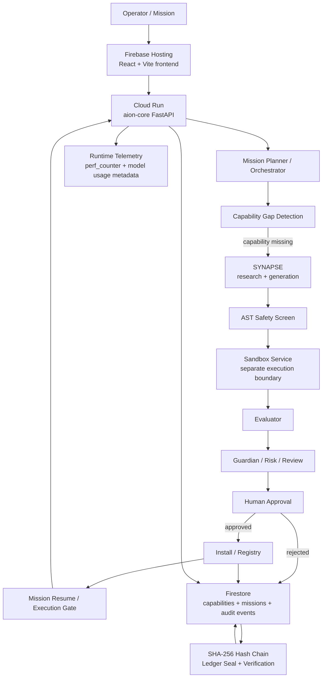

# AION AXON — Final Architecture

This diagram intentionally describes the **current repository architecture**, not the older 15-stage submission draft.

## Evidence notes

- `app/api.py` is the FastAPI HTTP control surface.
- `app/missions/` contains mission orchestration and resume behavior.
- `app/synapse/` contains generation, safety screening, evaluator and sandbox client integration.
- `app/governance/` contains approval, guardian, risk, owner authorization, kill switch and execution controls.
- `app/memory/firestore_store.py` provides the persistence abstraction and rehydration support.
- `app/observability/telemetry.py` measures execution duration with `time.perf_counter()` and reads model usage from response metadata when present.
- `app/beastmode/ledger_chain.py` computes SHA-256 event and chain hashes and stores the seal in Firestore.
- `web/src/` renders the live command, pipeline, evidence, ledger and mission surfaces.

## Explicit boundaries

- The current repository does not establish a 15-stage production contract.
- The current repository does not establish `AXON RUSTOS v1.1.0` or `AXON-WEB-V6.1.4` as a build identifier.
- The backend application declares version `0.3.0`.
- The ledger is tamper-evident, not tamper-proof.
- Live deployment revision and production headers were not independently retrievable from this audit environment.
